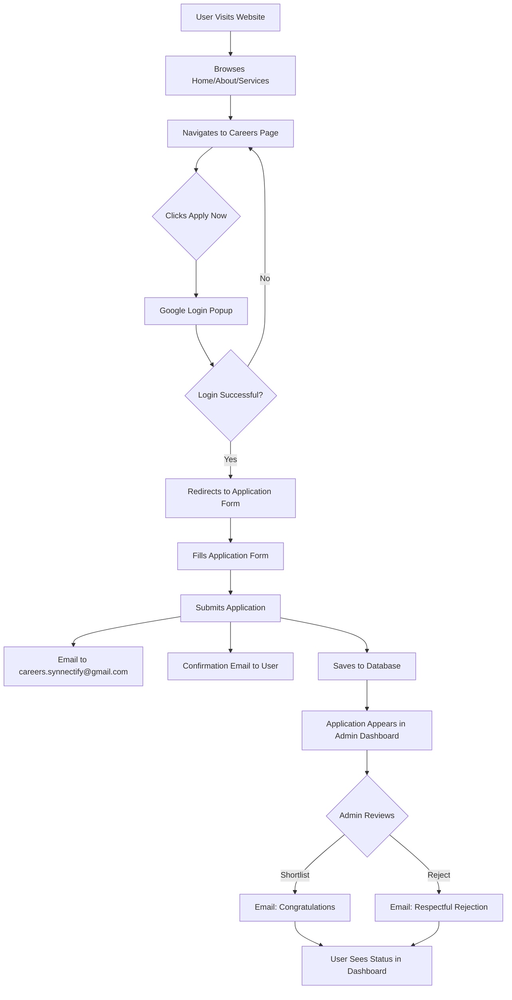

# SYNNECTIFY Career Portal - Complete System Documentation

## 🎯 Overview

This document describes the complete job application and management system for SYNNECTIFY, including user authentication, job applications, email notifications, and admin dashboard.

## ✨ Features Implemented

### 1. **User Authentication Flow**
- ✅ **No Login on Home Page** - Users can browse the website freely
- ✅ **Login Triggered on Apply** - Authentication starts only when clicking "Apply Now" on careers page
- ✅ **Google OAuth Integration** - Users login with their Gmail account
- ✅ **User Profile Display** - Shows Google profile picture in header after login
- ✅ **User Dashboard Access** - Authenticated users can view their applications and apply to jobs

### 2. **Job Application System**
- ✅ **Apply from Careers Page** - Direct application from job listings
- ✅ **Apply from Dashboard** - Authenticated users can apply from their dashboard
- ✅ **Resume Upload** - Support for PDF, DOC, DOCX files (max 5MB)
- ✅ **Form Pre-fill** - Auto-fills user data from Google account
- ✅ **Application Tracking** - Users can see their application history and status

### 3. **Email Notification System**
All emails feature professional SYNNECTIFY branding with gradient headers and responsive design.

#### **Email 1: To Company (`careers.synnectify@gmail.com`)**
- Sent immediately when user submits application
- Contains all applicant details (name, email, phone, DOB, LinkedIn, etc.)
- Includes job position and application date
- Notifies about resume attachment

#### **Email 2: To Applicant (Confirmation)**
- Sent immediately after application submission
- Professional branded template with SYNNECTIFY logo
- Confirms receipt of application
- Shows application status as "Pending Review"
- Provides company contact email

#### **Email 3: To Applicant (Status Update - Shortlisted)**
- Sent when admin accepts/shortlists an application
- Congratulatory message with green gradient
- Informs about next steps in recruitment process

#### **Email 4: To Applicant (Status Update - Rejected)**
- Sent when admin rejects an application
- Professional and respectful rejection message
- Encourages future applications

### 4. **Admin Dashboard**
- ✅ **Application Management** - View all applications with detailed information
- ✅ **Status Updates** - Shortlist or Reject applications with one click
- ✅ **Automatic Email Notifications** - Status change emails sent automatically
- ✅ **Job Management** - View and delete job postings
- ✅ **Statistics** - Total jobs, applications, and pending reviews
- ✅ **Admin Authentication** - Secure admin access with JWT tokens

### 5. **User Dashboard**
- ✅ **Application History** - View all submitted applications with status
- ✅ **Available Jobs** - Browse and apply to open positions
- ✅ **Status Tracking** - See application status (Pending, Shortlisted, Rejected)
- ✅ **Personalized Welcome** - Greets user by name from Google account

## 📋 User Flow



## 🔧 Technical Architecture

### Frontend Stack
- **React 18** with TypeScript
- **Vite** for build tooling
- **Tailwind CSS** for styling
- **React Router** for navigation
- **Google OAuth** (`@react-oauth/google`) for authentication
- **Lucide React** for icons

### Backend Stack
- **Node.js** with Express
- **MongoDB** with Mongoose
- **JWT** for authentication
- **Nodemailer** for email service
- **Multer** for file uploads

### Database Schema

#### Application Model
```javascript
{
  jobId: ObjectId (ref: 'Job'),
  name: String (required),
  email: String (required, lowercase),
  resume: String (file path),
  message: String,
  status: Enum ['Pending', 'Shortlisted', 'Rejected', 'Ignored'],
  appliedAt: Date (default: now)
}
```

#### Job Model
```javascript
{
  title: String (required),
  description: String (required),
  location: String (required),
  type: String (required),
  department: String,
  experience: String,
  salary: String,
  createdAt: Date (default: now)
}
```

## 🚀 Setup Instructions

### 1. Backend Setup

```bash
cd server

# Install dependencies
npm install

# Configure environment variables
cp .env.example .env
# Edit .env with your credentials
```

#### Required Environment Variables
```env
MONGODB_URI=mongodb://localhost:27017/synnectify-careers
PORT=5000
CLIENT_URL=http://localhost:5173
JWT_SECRET=your_secret_key
EMAIL_USER=careers.synnectify@gmail.com
EMAIL_PASS=your_gmail_app_password
```

#### Get Gmail App Password
1. Go to [Google Account Security](https://myaccount.google.com/security)
2. Enable 2-Step Verification
3. Go to [App Passwords](https://myaccount.google.com/apppasswords)
4. Create password for "Mail"
5. Copy 16-character password to `EMAIL_PASS` in `.env`

```bash
# Start MongoDB (if local)
mongod

# Run server
npm run dev
```

### 2. Frontend Setup

```bash
cd .. # back to root

# Install dependencies
npm install

# Configure environment
# Create .env file with:
# VITE_API_URL=http://localhost:5000/api
# VITE_GOOGLE_CLIENT_ID=your_google_oauth_client_id

# Run development server
npm run dev
```

#### Get Google OAuth Client ID
1. Go to [Google Cloud Console](https://console.cloud.google.com/)
2. Create a new project or select existing
3. Enable Google+ API
4. Go to Credentials → Create Credentials → OAuth Client ID
5. Configure OAuth consent screen
6. Add authorized origins: `http://localhost:5173`
7. Add authorized redirect URIs: `http://localhost:5173`
8. Copy Client ID to `.env` file

### 3. Database Seeding (Optional)

```bash
cd server
node seed.js
```

This creates sample job postings in your database.

## 📧 Email Templates

All emails use responsive HTML templates with:
- SYNNECTIFY gradient branding
- Mobile-friendly design
- Professional typography
- Clear call-to-actions
- Company contact information

### Email Styling Guidelines
- **Primary Color**: Orange (#f97316)
- **Secondary Color**: Blue (#3b82f6)
- **Success Color**: Green (#10b981)
- **Neutral Color**: Gray (#6b7280)

## 🔐 Admin Access

### Creating an Admin User

#### Option 1: Direct Database Insertion
```javascript
// In MongoDB shell or Compass
db.users.insertOne({
  email: "admin@synnectify.com",
  password: "hashed_password_here", // Use bcrypt to hash
  role: "admin"
});
```

#### Option 2: Through Auth Route
```bash
POST http://localhost:5000/api/auth/register
{
  "email": "admin@synnectify.com",
  "password": "your_secure_password",
  "role": "admin"
}
```

### Accessing Admin Dashboard
1. Login with admin credentials
2. Navigate to `/admin` route
3. View applications and manage job postings

## 🎨 UI/UX Features

### Preserved Design Elements
- ✅ All original animations and transitions
- ✅ Gradient backgrounds
- ✅ Hover effects
- ✅ Loading states
- ✅ Responsive design
- ✅ Icon integrations
- ✅ Color scheme consistency

### New Components
- **UserProfile** - Dropdown menu with user info and logout
- **Dashboard** - User application tracking
- **AdminDashboard** - Application and job management

## 📱 Responsive Design

All components are fully responsive:
- **Mobile** (< 640px): Single column layout
- **Tablet** (640px - 1024px): Two column grid
- **Desktop** (> 1024px): Full multi-column layout

## 🔒 Security Features

- ✅ JWT token authentication
- ✅ Protected routes (require authentication)
- ✅ Role-based access control (admin vs user)
- ✅ File upload validation (type and size)
- ✅ Email validation
- ✅ CORS configuration
- ✅ Environment variable protection

## 📊 Application Status Workflow

```
Application Submitted
        ↓
   Pending Review (Yellow Badge)
        ↓
    ┌───┴───┐
    ↓       ↓
Shortlisted Rejected
(Green)    (Red)
    ↓       ↓
[Email]  [Email]
```

## 🐛 Troubleshooting

### Email Not Sending
- Check `EMAIL_USER` and `EMAIL_PASS` in `.env`
- Verify Gmail App Password is correct
- Ensure 2-Step Verification is enabled
- Check SMTP settings (host and port)

### Google Login Not Working
- Verify `VITE_GOOGLE_CLIENT_ID` is correct
- Check authorized origins in Google Cloud Console
- Ensure OAuth consent screen is configured

### Application Not Saving
- Check MongoDB connection
- Verify database is running
- Check console for error messages

### Admin Can't Access Dashboard
- Verify user role is "admin" in database
- Check JWT token is valid
- Ensure user is logged in

## 📞 Support

For issues or questions:
- **Email**: careers.synnectify@gmail.com
- **Documentation**: This file
- **Code Comments**: Inline documentation in source files

## 🎉 Success Metrics

Upon successful implementation, the system should:
- ✅ Allow users to browse without login
- ✅ Trigger login only on job application
- ✅ Send emails to both company and applicant
- ✅ Display user profile with Google photo
- ✅ Track application status
- ✅ Allow admin to manage applications
- ✅ Send automated status update emails
- ✅ Maintain all original styling and animations

## 📝 Notes

- All emails are sent from "noreply@synnectify.com" but use careers.synnectify@gmail.com SMTP
- Resume files are stored in `server/uploads/` directory
- Application data is stored in MongoDB
- Google profile data is cached in localStorage
- No database changes required for existing job data

---

**Version**: 1.0  
**Last Updated**: 2025-01-18  
**Maintained By**: SYNNECTIFY Development Team
