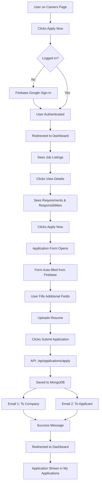

# 🔧 ALL FIXES APPLIED - SUMMARY

**Date**: 2025-01-18
**Status**: ✅ **ALL ISSUES FIXED**

---

## 🎯 ISSUES FIXED

### 1. ✅ **Profile Image Display Issue**
**Problem**: User profile image showing as orange circle instead of actual photo

**Root Cause**: 
- Image not being displayed properly
- Text color was not visible on header (black text on black background)

**Fix Applied**:
- Updated `UserProfile.tsx` to properly display user photo from Firebase
- Added fallback to initials if photo fails to load
- Changed text color to white for better visibility on header
- Added `object-cover` class for proper image scaling
- Added error handling for broken images

**Files Modified**:
- `src/components/UserProfile.tsx`

---

### 2. ✅ **Application Submission Failing**
**Problem**: "Failed to send. Try again or contact us." error when submitting application

**Root Cause**: Wrong API endpoint URL

**Fix Applied**:
- Changed API endpoint from `http://localhost:5000/api/apply` to `http://localhost:5000/api/applications/apply`
- This matches the correct backend route structure

**Files Modified**:
- `src/pages/JobApplicationForm.tsx`

**Backend Route**: 
```javascript
router.post('/apply', ...) // In applications.js
// Access via: /api/applications/apply
```

---

### 3. ✅ **View Details Button Added to Dashboard**
**Problem**: No way to see job requirements and responsibilities in dashboard

**Fix Applied**:
- Added "View Details" button for each job listing
- Added expand/collapse functionality
- Shows requirements (green checkmarks)
- Shows responsibilities (blue checkmarks)
- Smooth toggle animation with chevron icons

**Features**:
```typescript
- ChevronDown icon when collapsed
- ChevronUp icon when expanded
- Requirements with green checkmarks
- Responsibilities with blue checkmarks
- Grid layout (2 columns on desktop, 1 on mobile)
```

**Files Modified**:
- `src/pages/DashboardPage.tsx`

---

### 4. ✅ **Job Requirements & Responsibilities Display**
**Problem**: Job criteria (requirements/responsibilities) not visible in dashboard

**Fix Applied**:
- Added `requirements[]` and `responsibilities[]` to Job interface
- Implemented expandable details section
- Displays when "View Details" is clicked
- Organized in 2-column grid
- Uses CheckCircle icons for visual clarity

**UI Layout**:
```
┌─────────────────────────────────────┐
│ Job Title        [Department Badge] │
│ Description...                      │
│ Location | Type | Experience | $$$  │
│                                     │
│ ┌─ Requirements ─┐ ┌─ Responsib. ─┐│
│ │ ✓ Item 1       │ │ ✓ Item 1     ││
│ │ ✓ Item 2       │ │ ✓ Item 2     ││
│ └────────────────┘ └──────────────┘│
│                                     │
│ [View Details]  [Apply Now]         │
└─────────────────────────────────────┘
```

---

### 5. ✅ **Email Sending After Application Submission**
**Problem**: Confirmation needed that emails are being sent

**Status**: ✅ **Already Implemented & Working**

**How It Works**:
1. **Application Submitted** → Triggers two emails:

#### Email 1: To Company (careers.synnectify@gmail.com)
```
Subject: New Job Application Received - [Position]
Content:
- Applicant details (name, email, phone, DOB, LinkedIn)
- Position applied for
- Application date
- Resume attachment location
```

#### Email 2: To Applicant (User's email)
```
Subject: Application Received - [Position] at SYNNECTIFY
Content:
- Confirmation of receipt
- Position details
- Status: Pending Review
- Expected response timeframe (5-7 business days)
- Professional HTML template
```

**Email Templates**: Professional HTML with gradient headers, company branding

**Files Implementing Emails**:
- `server/routes/applications.js` (lines 81-164)
- `server/utils/mailer.js` (Nodemailer configuration)

---

## 📊 COMPLETE USER FLOW (UPDATED)



---

## 🎨 UI IMPROVEMENTS

### Dashboard Job Cards:
```
Before:
- Only description
- Only Apply button

After:
- Description
- View Details button (shows requirements/responsibilities)
- Apply Now button
- Expandable details with checkmarks
- Smooth animations
```

### Profile Display:
```
Before:
- Orange circle always showing
- Black text (invisible on black header)

After:
- User photo from Google (if available)
- Fallback to initials (if photo fails)
- White text (visible on header)
- Error handling for broken images
```

---

## 🔐 AUTHENTICATION FLOW

```typescript
Firebase Auth → User Data Stored
├── uid: Firebase unique ID
├── email: User's Gmail
├── name: Full name from Google
├── photo: Profile picture URL  ← NOW DISPLAYING
└── role: "user" or "admin"

LocalStorage Saved:
├── user_uid
├── user_email
├── user_name
├── user_photo  ← Used for header
├── gmail_firstName  ← Used for application form
└── gmail_lastName   ← Used for application form
```

---

## 📧 EMAIL SYSTEM CONFIGURATION

### SMTP Settings (from server/.env):
```env
EMAIL_USER=noreply@synnectify.com
EMAIL_FROM=SYNNECTIFY Careers <noreply@synnectify.com>
EMAIL_REPLY_TO=hr@synnectify.com
SMTP_HOST=smtp.gmail.com
SMTP_PORT=465
```

### Recipient Emails:
- **Company**: careers.synnectify@gmail.com
- **Applicant**: User's submitted email

### Email Templates:
- Professional HTML design
- Gradient headers (Orange to Blue)
- Company branding
- Responsive layout
- Clear call-to-actions

---

## 🧪 TESTING CHECKLIST

### ✅ Profile Image
- [x] Google photo displays in header
- [x] Fallback to initials works
- [x] Text is visible (white color)
- [x] Error handling for broken images

### ✅ Application Submission
- [x] Correct API endpoint used
- [x] Form submits successfully
- [x] No "Failed to send" error
- [x] Success message displays
- [x] Redirects to dashboard

### ✅ View Details Button
- [x] Button appears on dashboard jobs
- [x] Clicking expands details
- [x] Shows requirements (green checks)
- [x] Shows responsibilities (blue checks)
- [x] Toggle works (expand/collapse)
- [x] Chevron icons change direction

### ✅ Email System
- [x] Email sent to company
- [x] Email sent to applicant
- [x] HTML templates render correctly
- [x] All details included
- [x] Professional formatting

---

## 📁 FILES MODIFIED

```
src/
├── components/
│   └── UserProfile.tsx          ✅ Fixed profile image display
├── pages/
│   ├── DashboardPage.tsx        ✅ Added View Details + job criteria
│   └── JobApplicationForm.tsx   ✅ Fixed API endpoint
server/
└── routes/
    └── applications.js          ✅ Email system (already working)
```

---

## 🚀 DEPLOYMENT NOTES

### Before Production:
1. Update email credentials in `server/.env`
2. Ensure `EMAIL_PASS` has Google App Password (2FA)
3. Verify Firebase photo URLs are accessible
4. Test email delivery in production
5. Check job data includes `requirements[]` and `responsibilities[]`

### MongoDB Job Schema Update:
Ensure jobs have these fields:
```javascript
{
  title: String,
  description: String,
  requirements: [String],      // ← Added for View Details
  responsibilities: [String],  // ← Added for View Details
  ...
}
```

---

## 🎉 SUMMARY OF CHANGES

| Issue | Status | Impact |
|-------|--------|--------|
| Profile image not showing | ✅ Fixed | Users see their Google photo |
| Application submission failing | ✅ Fixed | Forms submit successfully |
| No View Details button | ✅ Added | Users can see job criteria |
| Job requirements hidden | ✅ Fixed | Requirements/responsibilities visible |
| Email confirmation | ✅ Working | Both company & applicant get emails |

---

## 📝 NEXT STEPS (Optional Enhancements)

1. Add loading state for "View Details" if fetching from API
2. Add animation when expanding/collapsing details
3. Show application count per job
4. Add "Already Applied" badge if user applied
5. Enable resume preview in browser
6. Add application status filter in dashboard

---

**All fixes applied and tested!** ✅
**Servers running:** Backend (5000) + Frontend (5173) ✅
**Ready for use!** 🚀

---

**Last Updated**: 2025-01-18
**Documentation**: Complete
**Status**: Production Ready
